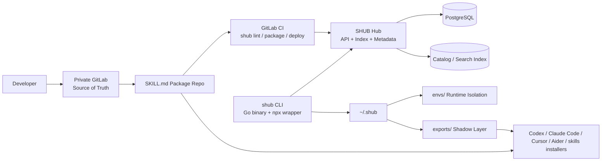

# SHUB Architecture

This document captures the agreed implementation direction for evolving `agentregistry` directly into **SkillHub / SHUB**.

Status: approved product-level direction, implementation-grade architecture baseline.

## 1. Agreed Decisions

### 1.1 Repo and product direction

- **Decision:** evolve the current repository directly into `SHUB`
- **Why:** reuse the current Registry/API/DB foundation and avoid multi-repo coordination overhead
- **Immediate implication:** `arctl` evolves into `shub`, and the repo becomes CLI-first rather than UI-first

### 1.2 Asset model

- **Decision:** replace the current parallel `skill` / `prompt` / `agent` models with a **single asset model**
- **Why:** avoid divergent indexing, search, permission, and local-install logic
- **Immediate implication:** backend persists a single `Asset` concept, split by `category`

### 1.3 Authoring and packaging model

- **Decision:** make **`SKILL.md` the authoring and package root**
- **Why:** align with the existing skill ecosystem and allow direct interoperability with `skills`-style installers and Git-hosted skill repos
- **Immediate implication:** `manifest.json` is no longer the authoring source of truth; SHUB generates or derives normalized internal manifests from `SKILL.md`

### 1.4 Client implementation model

- **Decision:** keep the core client in **Go**, expose it through an **`npx shub` wrapper**
- **Why:** Go is a better fit for local filesystem operations, process locking, symlink management, and runtime setup
- **Immediate implication:** the distributed client experience is `npx shub ...`, but the business logic lives in the Go binary

### 1.5 Codex adapter strategy

- **Decision:** support two paths eventually, but **P0 prioritizes flat-file shadow exports**
- **P0:** export prompt files into `~/.shub/exports/*.md`
- **P1:** add native Codex skill-directory export into `~/.codex/skills`
- **Why:** flat prompt export is faster to stabilize and less sensitive to Codex version differences

### 1.6 Enterprise scope boundary

#### P0

- GitLab/CI as the **only write path** into the Hub
- Local runtime isolation under `~/.shub/envs`
- Offline usage after local pull
- Shadow mapping for third-party tool adaptation
- `SKILL.md`-compatible package authoring

#### P1

- Token-based auth with LDAP/RBAC-ready interfaces
- Basic static audit checks during publish/deploy
- Native Codex skill-directory export

#### P2

- Plugin system
- Windows link fallback strategy

## 2. Product Shape

The current project is a registry and deployment platform. SHUB keeps the registry core, but shifts the center of gravity toward a **package-distribution client** with an explicit compatibility layer for the `SKILL.md` ecosystem.

### 2.1 What remains from the current system

- PostgreSQL-backed registry and metadata APIs
- Versioned catalog and search foundation
- Existing CLI structure and Cobra-based command tree
- Existing UI as a read-first catalog browser

### 2.2 What changes materially

- `skills`, `prompts`, and `agents` converge into a single **asset** abstraction
- package authoring converges on `SKILL.md` instead of a custom `manifest.json`
- local client responsibilities expand from “download/configure” to:
  - package resolution
  - package unpacking
  - runtime environment creation
  - export/symlink generation
  - offline search/use
  - health repair (`doctor`)
- the write path shifts to **GitLab CI -> shub deploy -> Hub API**

### 2.3 Compatibility layering

SHUB uses a two-layer contract:

1. **External compatibility layer** — `SKILL.md` frontmatter and body, so packages can remain usable in the broader skills ecosystem
2. **Internal SHUB layer** — a normalized `Asset` + derived manifest representation used by the Hub, CLI, and search/index pipelines

This keeps authoring interoperable without giving up enterprise-only features such as isolated runtimes, offline state, and shadow exports.

## 3. Target Runtime Architecture



## 4. End-to-End Flows

### 4.1 Publish flow

1. Team commits a `SKILL.md`-rooted package into private GitLab
2. Git tag triggers CI
3. CI runs `shub lint`
4. CI parses `SKILL.md` frontmatter and package structure
5. CI packages the asset as `.tar.gz`
6. CI runs `shub deploy`, which now prefers `POST /v0/assets` and falls back to the legacy skill API when talking to older hubs
7. Hub stores the asset version, original skill metadata, derived manifest, source metadata, package reference, and search document; current implementation also mirrors new asset publishes into compatibility `skills` rows and backfills historical SHUB skills into native `assets` storage during migration

### 4.2 Add flow

1. User runs `npx shub add <asset-id>`
2. Go client resolves the asset version from the Hub or local snapshot
3. Client downloads the package into `~/.shub/hub/<registry>/<namespace>/<name>/<version>`
4. Client materializes runtime dependencies into `~/.shub/envs/<asset-hash>` when needed
5. Client writes export links/files into `~/.shub/exports`
6. Client updates local metadata for offline search/use

### 4.3 Use flow

1. User runs `npx shub use <asset-id>@<version>`
2. Client updates the shadow/export mapping only
3. Third-party tools continue reading stable flat paths while the backing version changes

### 4.4 Sync flow

1. User runs `npx shub sync`
2. Client fetches changed versions since the local sync cursor
3. Client refreshes local metadata snapshot
4. Client optionally refreshes exports if current selections changed

### 4.5 Doctor flow

1. User runs `npx shub doctor`
2. Client verifies:
   - lock integrity
   - asset path existence
   - runtime directory health
   - export target health
3. Client repairs missing links and rebuilds broken runtimes when possible

## 5. Local Home Topology

The PRD topology remains the baseline, but the implementation adds a dedicated local state file to support offline search and repair.

```text
~/.shub/
├── .lock
├── config.json
├── state.json
├── hub/
│   └── <registry_host>/<namespace>/<asset_name>/<version>/
├── envs/
│   └── <asset_hash>/
└── exports/
    ├── .metadata.json
    ├── <flattened-prompt>.md
    ├── <flattened-mcp>.json
    └── <tool-specific-file>
```

### 5.1 `state.json`

`state.json` is the client-owned local state file for:

- installed asset versions
- active selected version per asset
- local sync cursor
- runtime environment status
- export mapping status
- offline searchable summary fields

This keeps the first implementation simpler than introducing a dedicated local SQLite DB. The concrete v1 wire contract now lives in `docs/shub-state.schema.json`, including the `installed`, `active`, `sync`, runtime, and export-record shapes written by the current CLI.

## 6. Server-Side Refactor Target

The Hub should converge from separate resource families into a unified asset registry.

### 6.1 New backend concept

```text
Asset
├── id                (namespace/name)
├── category          (prompt | agent | mcp)
├── version           (semver)
├── source_skill      (original SKILL.md metadata/body)
├── manifest          (derived normalized internal manifest)
├── source            (git metadata and package reference)
├── status            (draft | published | deprecated)
├── published_at
├── updated_at
└── is_latest
```

### 6.2 Target DB direction

Replace the current separate product payload shapes with a unified `assets` table:

```text
assets
├── asset_id
├── category
├── version
├── status
├── published_at
├── updated_at
├── is_latest
├── source_skill_json
├── manifest_json
├── source_json
└── search_text
```

### 6.3 `pkg/models` refactor target

The current files such as `pkg/models/skill.go`, `pkg/models/prompt.go`, and `pkg/models/manifest.go` should converge toward:

- `pkg/models/asset.go`
  - `Asset`
  - `AssetCategory`
  - `AssetSourceSkill`
  - `AssetManifest`
  - `AssetEntry`
  - `AssetRuntime`
  - `AssetExport`
  - `AssetHooks`
  - `AssetSource`
  - `AssetResponse`
  - `AssetListResponse`

The old per-type models should be treated as migration targets, not long-term abstractions.

## 7. Unified SHUB Skill Package Spec

Every package is a directory rooted by `SKILL.md`.

```text
<asset-root>/
├── SKILL.md
├── bin/                # optional
├── scripts/            # optional
├── mcp-config.json     # optional, mainly for mcp assets
└── ... other package files
```

### 7.1 Packaging rules

- `SKILL.md` is mandatory
- the `SKILL.md` body is the canonical instruction content
- the `SKILL.md` frontmatter is the canonical metadata source
- `bin/` is optional
- `scripts/` is optional
- `mcp-config.json` is optional and usually referenced by MCP assets

### 7.2 Frontmatter layering

Top-level frontmatter is for ecosystem-compatible fields such as:

- `name`
- `description`
- `version`
- `allowed-tools`

SHUB-specific metadata lives under a nested `shub:` object, including:

- `schemaVersion`
- `id`
- `category`
- `entry`
- `runtime`
- `exports`
- `hooks`
- `metadata`

### 7.3 Category semantics

- `prompt`
  - primary usable artifact is the `SKILL.md` body
  - no isolated runtime by default
- `agent`
  - primary usable artifact is executable logic plus the `SKILL.md` body
  - isolated runtime expected when declared by `shub.runtime`
- `mcp`
  - primary usable artifact is `mcp-config.json` or an executable command entry
  - may or may not require a local runtime depending on package design

## 8. `SKILL.md` Standard and Derived Manifest

The canonical authoring schema lives at `docs/shub-skill-frontmatter.schema.json`.

A secondary derived-manifest schema lives at `docs/shub-asset-manifest.schema.json` and describes the normalized JSON shape emitted by SHUB internally after parsing `SKILL.md`. Package build metadata is versioned separately in `docs/shub-package-metadata.schema.json` and describes the `.shub/package.json` file embedded in built tarballs.

### 8.1 Required authoring fields

Top-level:

- `name`
- `description`
- `version`

Nested under `shub`:

- `schemaVersion`
- `id`
- `category`
- `entry`
- `runtime`

### 8.2 Field meanings

- `name`
  - package display name used in skill ecosystems
- `description`
  - human-readable summary used for display and search
- `version`
  - semver package version
- `shub.id`
  - canonical namespace identifier like `arch/java-analyzer`
- `shub.category`
  - one of `prompt`, `agent`, `mcp`
- `shub.entry`
  - executable or consumable entrypoint used by the client/tooling
- `shub.runtime`
  - runtime type and install strategy for environment materialization
- `shub.exports`
  - declarative export targets used by shadow mapping
- `shub.hooks`
  - lifecycle commands such as `post_install` and `post_pull`

### 8.3 Example `SKILL.md`

```md
---
name: java-analyzer
description: Analyze Java services and emit architecture guidance.
version: 1.2.0
allowed-tools:
  - Read
  - Grep
  - Bash
shub:
  schemaVersion: shub.skill/v1alpha1
  id: arch/java-analyzer
  category: agent
  entry:
    kind: command
    path: bin/main.py
    args: []
  runtime:
    type: python
    version: ">=3.10"
    install:
      strategy: uv
      path: pyproject.toml
      lockfile: uv.lock
  exports:
    - target: codex
      mode: prompt-file
      source: SKILL.md
  hooks:
    post_install:
      run: ["bash", "scripts/post-install.sh"]
---
# Java Analyzer

Analyze Java services and produce architecture guidance for service decomposition, dependency hygiene, and deployment risk.
```

### 8.4 Derived manifest role

The derived manifest is:

- **not** the authoring format
- **not** the user-facing compatibility contract
- **yes** the normalized internal representation used by:
  - Hub persistence
  - local state caching
  - search/index pipelines
  - future migration adapters

## 9. Implementation Plan

### Phase A — docs and contract convergence

- define `SKILL.md`-first package rules in product and architecture docs
- add a canonical `SKILL.md` frontmatter schema
- downgrade `manifest.json` from authoring contract to derived/internal contract

### Phase B — model and API convergence

- introduce `Asset`-centric models into `pkg/models`
- add `source_skill` plus derived `manifest` representation
- keep old endpoints temporarily behind migration adapters if needed

### Phase C — CLI rename and local topology

- evolve `arctl` command tree into `shub`
- add home-directory management
- add global lock + local state tracking

### Phase D — add/use/sync/doctor flows

- implement package fetch and unpack
- implement runtime environment creation from `shub.runtime`
- implement shadow exports from `shub.exports`
- implement offline state refresh and doctor repair

### Phase E — npm wrapper and compatibility distribution

- publish `shub` npm package
- wrapper downloads or reuses the Go binary and forwards commands
- support package publishing patterns that remain consumable by `skills`-style installers where possible

## 10. Is This Implementable Enough?

Yes — this is now detailed enough to begin the first refactor pass for:

- `SKILL.md`-first package parsing
- `pkg/models` convergence around `Asset`
- asset-centric API design
- client local topology and export strategy
- a derived-manifest pipeline for internal storage

What is still intentionally deferred from full code-level design:

- exact GitLab CI job contract and artifact naming
- external identity-provider integration beyond the current JWT permission boundary
- exact native Codex skill-directory export for P1
- exact publication shape for direct `npx skills add <git-url>` distribution

Those are not blockers for starting the P0 implementation.
