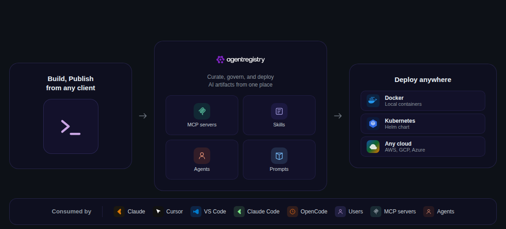
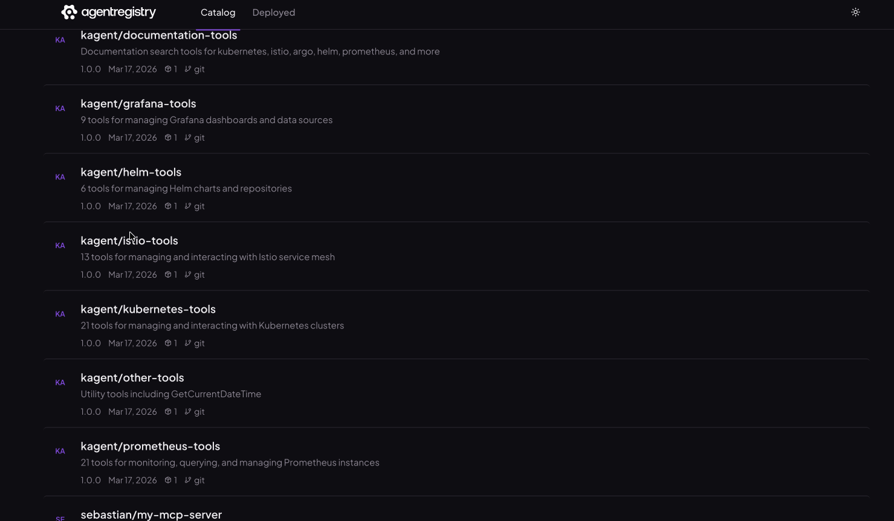

<p align="center">
  <picture>
    <source media="(prefers-color-scheme: dark)" srcset="img/skill-hub-logo-dark.svg">
    <source media="(prefers-color-scheme: light)" srcset="img/skill-hub-logo-light.svg">
    
  </picture>
</p>

<p align="center">
  English · <a href="./README.zh-CN.md">简体中文</a>
</p>

<p align="center">
  <a href="https://github.com/yaogdu/skill-hub/stargazers"></a>
  &nbsp;
  <a href="https://discord.gg/HTYNjF2y2t"></a>
  &nbsp;
  <a href="https://github.com/yaogdu/skill-hub/releases"></a>
  &nbsp;
  <a href="LICENSE"></a>
  &nbsp;
  <a href="https://golang.org/doc/install"></a>
</p>

<p align="center">
  <a href="https://github.com/yaogdu/skill-hub">GitHub</a> · <a href="https://github.com/yaogdu/skill-hub/releases">Releases</a> · <a href="#quick-start">Quick Start</a> · <a href="#documentation-map">Documentation</a> · <a href="./README.zh-CN.md">中文说明</a> · <a href="https://discord.gg/HTYNjF2y2t">Discord</a>
</p>

<p align="center">
  <strong>Publish. Resolve. Govern.</strong> One registry for MCP servers, agents, skills, and prompts.
</p>

---

## What is skill-hub?

`skill-hub` is an open-source registry and distribution hub for MCP servers, AI agents, skills, and prompts.

This repository is a downstream, open-source fork of [`agentregistry`](https://github.com/agentregistry-dev/agentregistry), with the dashboard and user-facing workflow focused on self-hosted skill distribution, SHUB package publishing, API-key based access control, and GitHub/GitLab-backed fallback imports.

It is primarily positioned for company-internal, private deployments: a team-owned skill and agent registry that you can run inside your own environment, govern with your own accounts and API keys, and connect to approved upstream sources only when you want to.

Right now, the MCP servers and AI tools your team needs are spread across npm, PyPI, Docker Hub, GitHub repos, and random URLs. Nobody knows which ones are trustworthy, which versions work, or how to get them running. Every developer is doing their own manual Docker setup and IDE configuration.

skill-hub puts all of that into a single registry with a CLI and a web UI. You import or publish artifacts once, and then anyone on your team can discover approved versions, resolve fixed dependencies, and have their IDE automatically configured to use them.

---

## Why skill-hub?

- **One trusted source for AI building blocks** — a curated catalog instead of scattered repos, scripts, and one-off MCP setup
- **Faster developer onboarding** — discover approved artifacts quickly with less manual configuration
- **Consistent path from laptop to CI** — same discovery, dependency resolution, and delivery workflow across local dev and build pipelines
- **Governance without slowing teams down** — centralize curation and publishing without forcing each team to rebuild the process

<p align="center">
  
</p>

<table>
<tr>
<td width="50%" valign="top">
<h3>For Organizations</h3>
<p><strong>Curate &amp; Distribute</strong></p>
<p>Package, collect, and enrich AI artifacts from any source in a single centralized registry.</p>
<ul>
  <li><strong>Centralized Control</strong> - Package and collect AI artifacts from any source into a single registry</li>
  <li><strong>Security &amp; Governance</strong> - Curate and approve agents, servers, and skills before company-wide consumption</li>
  <li><strong>Enriched Metadata</strong> - Add context to help assess trustworthiness and security</li>
</ul>

</td>
<td width="50%" valign="top">
<h3>For Developers</h3>
<p><strong>Build &amp; Publish</strong></p>
<p>Build, test, publish, and install AI artifacts with minimal dependencies.</p>
<ul>
  <li><strong>Local Development</strong> - Create and test agents, skills, and MCP servers locally</li>
  <li><strong>Easy Publishing</strong> - Publish your artifacts to a registry with a single command</li>
  <li><strong>Pull &amp; Run Anywhere</strong> - Pull artifacts from the registry and run them in any environment instantly</li>
  <li><strong>Discover &amp; Consume</strong> - Find new artifacts to add to registry or optimize existing artifacts</li>
</ul>

</td>
</tr>
</table>

<a id="quick-start"></a>
## Quick Start

**Prerequisites:** Docker Desktop with Docker Compose v2+

```bash
# 1. Build the local server image
docker build \
  -f docker/server.Dockerfile \
  -t localhost:5001/agentregistry-dev/agentregistry/server:dev \
  .

# 2. Start skill-hub
env VERSION=dev DOCKER_REGISTRY=localhost:5001 docker compose \
  -f internal/daemon/docker-compose.yml \
  up -d

# 3. Open the dashboard
# http://localhost:12121
```

The bundled Compose stack persists uploaded SHUB packages under `${HOME}/Documents/skill-storage` on the host and mounts that path into the container as `/var/lib/agentregistry/storage`.

### Install The CLI

```bash
curl -fsSL https://raw.githubusercontent.com/yaogdu/skill-hub/main/scripts/get-arctl | bash
arctl version
```

If you only need SHUB pull/install flows, you can also use the npm wrapper directly:

```bash
npx @yaogdu-skill-hub/shub search java
```

### First Login

- Open `http://localhost:12121`
- Sign in with the bootstrap administrator account
- Default credentials: `admin` / `admin`
- Go to `Settings` to create API keys, add users, manage fallback sources, and toggle anonymous SHUB read access

### Point CLI And npm Wrapper At Your Registry

After you create an API key in the dashboard:

```bash
# zsh / bash
export SHUB_API_BASE_URL=http://localhost:12121/v0
export SHUB_API_TOKEN=<your-api-key>

# optional: arctl reads these too
export ARCTL_API_BASE_URL=http://localhost:12121/v0
export ARCTL_API_TOKEN=<your-api-key>
```

```fish
set -gx SHUB_API_BASE_URL http://localhost:12121/v0
set -gx SHUB_API_TOKEN <your-api-key>
set -gx ARCTL_API_BASE_URL http://localhost:12121/v0
set -gx ARCTL_API_TOKEN <your-api-key>
```

You can then use either the Go CLI (`arctl`) or the npm wrapper (`npx @yaogdu-skill-hub/shub`) against the same self-hosted registry.

<a id="documentation-map"></a>
## Documentation Map

- [`README.md`](./README.md): product overview, self-hosting entry points, auth model, and SHUB workflow
- [`README.zh-CN.md`](./README.zh-CN.md): Chinese overview for private deployment, operations, and onboarding
- [`DEVELOPMENT.md`](./DEVELOPMENT.md): local development setup and contributor workflow
- [`ARCHITECTURE.md`](./ARCHITECTURE.md): architecture and SHUB package model
- [`RELEASING.md`](./RELEASING.md): GitHub Release, npm wrapper publish, and release checklist
- [`examples/shub/README.md`](./examples/shub/README.md): runnable skill package examples
- [`npm/shub/README.md`](./npm/shub/README.md): npm wrapper usage for `npx @yaogdu-skill-hub/shub`
- [`CONTRIBUTING.md`](./CONTRIBUTING.md): contribution process and project guidelines

---

## Core Capabilities

### Build

Create, scaffold, and publish the building blocks of your agentic infrastructure.

- **MCP servers** — Register servers from npm (`npx`), PyPI (`uvx`), OCI/Docker images, or remote HTTP/SSE endpoints. Each entry supports versioning, environment variables, package references, and automated quality scores.
- **Skills / SHUB packages** — Build structured knowledge packages rooted by `SKILL.md`. Author with `arctl skill init`, validate and package with `arctl shub lint` / `arctl shub package`, publish with `arctl shub deploy`, configure named fallback sources with `arctl shub source ...`, and consume locally with `npx @yaogdu-skill-hub/shub add`, `use`, `sync`, and `doctor` through the npm wrapper under `npm/shub/`. Current SHUB publish flow prefers the unified `/v0/assets` API and falls back to the legacy `/v0/skills` compatibility path when needed. New asset publishes are mirrored into the legacy skill model for compatibility, native asset migration backfills historical SHUB skills into the `assets` table, and `npx @yaogdu-skill-hub/shub add` can now automatically fall back to built-in and admin-configured upstream sources when the registry misses locally, with `-g` and `--fallback-source` available to narrow or force the lookup order.
- **Agents** — Define agents that bundle an identity with dependencies: which MCP servers it needs, which skills it uses, and how it should be configured. Scaffold with `arctl agent init`, then package everything into a versioned blueprint that CI/CD can resolve and publish reproducibly.
- **Prompts** — Create reusable instruction templates that define how an agent should behave in specific contexts. Version and store them alongside agents, skills, and servers so they're discoverable and shareable across your team.

### Web UI

A browser-based admin interface at `localhost:12121`. Browse the artifact catalog, add MCP servers, skills, and agents, review enrichment scores and metadata, manage fallback sources, and configure the registry — all without touching the CLI.

<p align="center">
  
</p>

### Built-in Access Control

- The first boot creates a built-in administrator account from `AGENT_REGISTRY_BOOTSTRAP_ADMIN_USERNAME` / `AGENT_REGISTRY_BOOTSTRAP_ADMIN_PASSWORD` and defaults to `admin` / `admin`.
- Administrators can sign in to `skill-hub`, create normal users, generate per-user API keys, toggle anonymous SHUB read access, and manage backend fallback sources.
- Normal users can view all registry content but can only mutate or delete the assets they own.
- CLI clients read `ARCTL_API_TOKEN` first and then fall back to `SHUB_API_TOKEN`, so the Go CLI and `npx @yaogdu-skill-hub/shub` share the same API-key flow.
- The settings page shows ready-to-paste snippets for `~/.zshrc`, `~/.bashrc`, and `~/.config/fish/config.fish`.

### Registry

Curate a shared catalog of MCP servers, agents, skills, and prompts your teams can trust and reuse.

- Publish artifacts to a central registry from npm, PyPI, Docker, OCI, or remote endpoints
- Discover approved artifacts through the CLI, REST API, or web UI at `localhost:12121`
- Give teams a consistent source of truth across environments
- Search by description ("query Postgres", "send Slack messages") instead of exact names — powered by pgvector

### Curation and Governance

Turn a broad set of available AI artifacts into a collection your organization is willing to support.

- Organize what developers can discover, install, and promote
- Review enrichment scores, versioning, and environment variable requirements
- Standardize how artifacts are shared across teams
- Keep control of what gets published and promoted

### Publishing and Consumption Workflows

Move from discovery to usage without reinventing the same packaging and dependency path for every team.

- Run lint, resolve, package, and publish workflows locally with `arctl`
- Run skill-hub itself with Docker Compose or deploy the registry service with Helm
- Support local development and CI/CD builds from the same registry
- Build and publish agents with explicit MCP, skill, and prompt dependencies recorded in `shub.lock`

### Client and Gateway Integration

Make approved artifacts easier to consume from the tools developers already use.

- Generate configuration for Claude Desktop, Cursor, and VS Code
- Export MCP and skill configuration that client tools can consume directly
- Reduce manual setup for AI clients and shared environments

### How It Works Together

1. Platform teams curate and publish approved MCP servers, agents, and skills in skill-hub
2. Developers discover those artifacts through the web UI or `arctl`
3. Teams resolve fixed versions into local workspaces or CI/CD pipelines
4. AI clients consume the exported configuration and packages through a consistent workflow

### SHUB Workflow

```bash
# authoring / CI side
arctl shub lint ./skills/java-analyzer
arctl shub resolve ./skills/java-analyzer
arctl shub package ./skills/java-analyzer
arctl shub deploy ./dist/java-analyzer-1.2.0.tar.gz --package-url https://gitlab.example.com/packages/java-analyzer-1.2.0.tar.gz
arctl shub deploy ./skills/java-analyzer   # infers origin git tree URL when run inside a git checkout

# client side
arctl shub source set github-main https://github.com/acme/skills/tree/main/skills
arctl shub source list
npx @yaogdu-skill-hub/shub search java
npx @yaogdu-skill-hub/shub add arch/java-analyzer
npx @yaogdu-skill-hub/shub add unfallenwill/supercoder -g
npx @yaogdu-skill-hub/shub add arch/java-analyzer --fallback-source github-main
npx @yaogdu-skill-hub/shub use arch/java-analyzer@1.2.0
npx @yaogdu-skill-hub/shub doctor
```

When you publish a local `.tar.gz` without `--package-url` and the registry exposes the package upload API, `arctl shub deploy` uploads that archive into the registry first and then publishes the asset with a registry-hosted download URL like `/v0/assets/{assetID}/versions/{version}/package`. The `deploy` subcommand name is kept for SHUB compatibility; it does not perform runtime MCP or agent deployment. The server stores uploaded archives under `AGENT_REGISTRY_STORAGE_DIR`, so private installations should mount durable storage there. The bundled Docker Compose stack mounts your host `${HOME}/Documents/skill-storage` into the container path `/var/lib/agentregistry/storage`, and the Helm chart exposes both `config.storageDir` and `packageStorage.*` for PVC-backed installations.

Agents and skills can declare fixed SHUB asset dependencies under `shub.dependencies` in `SKILL.md`, for example prompts, MCP servers, or other skills. `arctl shub resolve ./asset-dir` resolves those pinned `asset-id@version` references against the configured registry and writes `shub.lock`; `arctl shub resolve ./asset-dir --check` is intended for CI gates that must fail when the committed lockfile is stale. The dependency manifest does not embed registry URLs or credentials. Lookup uses the same CLI target settings as other SHUB commands: `--registry-url` / `ARCTL_API_BASE_URL` / `SHUB_API_BASE_URL` and `--registry-token` / `ARCTL_API_TOKEN` / `SHUB_API_TOKEN`. The dependency schema is documented in [`docs/shub-skill-frontmatter.schema.json`](./docs/shub-skill-frontmatter.schema.json), and the lockfile schema is documented in [`docs/shub-lock.schema.json`](./docs/shub-lock.schema.json).

### Publish A Local Skill

For a local skill directory:

```bash
arctl shub lint ./skills/ai-agent-learning-system
arctl shub resolve ./skills/ai-agent-learning-system
arctl shub package ./skills/ai-agent-learning-system
arctl shub deploy ./dist/ai-agent-learning-system-1.0.0.tar.gz
```

Fallback sources are backend-configured names that point at GitHub/GitLab/Bitbucket-style tree URLs. When `npx @yaogdu-skill-hub/shub add <asset-id>` misses in the registry, the client now automatically tries the built-in source pool first (`github-direct`, `github-skills-main`, `github-plugin-skills-main`, `openai-skills`, `anthropic-skills`) and then any admin-configured custom sources returned by the registry. `-g` narrows that miss-handling flow to the GitHub-oriented source pool, while `--fallback-source <name>` still lets you force a specific source order. On a successful pull, the server resolves the configured source address, clones the remote asset directory, packages it, stores the `.tar.gz` under registry-managed storage, and then publishes the mirrored asset back into `/v0/assets`. Source addresses support `{asset}`, `{name}`, and `{version}` placeholders; when no placeholder is present, the server appends the requested asset basename to the configured address.

### GitHub Compatibility Notes

- `github-direct` expects a repository whose root is already a SHUB skill package
- `github-skills-main` expects `skills/<name>/SKILL.md`
- `github-plugin-skills-main` expects `plugins/<name>/skills/<name>/SKILL.md`
- If the fetched repository already contains valid SHUB metadata, the registry preserves the upstream asset version
- If the fetched repository is a plain skill repo with frontmatter but without SHUB metadata, skill-hub now synthesizes a minimal prompt asset, adds default native skill-dir exports, and mirrors it into the registry
- When no explicit version was requested for a plain imported skill repo, the mirrored asset currently uses the fallback version `0.0.0-imported`

For Codex integration, `target: codex` + `mode: prompt-file` exports the current flat prompt into `~/.shub/exports`, while `target: codex` + `mode: skill-dir` exports a native skill directory into `~/.codex/skills` (override with `SHUB_CODEX_SKILLS_DIR` or `CODEX_HOME`). Claude Code can now consume SHUB exports natively too: `target: claude-code` + `mode: prompt-file` writes slash-command markdown into `.claude/commands` (override with `SHUB_CLAUDE_COMMANDS_DIR` or `SHUB_CLAUDE_WORKSPACE_DIR`), `target: claude-code` + `mode: skill-dir` writes native skills into `.claude/skills` (override with `SHUB_CLAUDE_SKILLS_DIR` or `SHUB_CLAUDE_WORKSPACE_DIR`), and `target: claude-code` + `mode: mcp-config` writes managed MCP snippets under `.claude/mcp/shub/` while refreshing the workspace `.mcp.json` and `.claude/settings.local.json` with SHUB-owned `mcpServers`, `enabledMcpjsonServers`, and `permissions.allow` entries (override with `SHUB_CLAUDE_MCP_DIR`, `SHUB_CLAUDE_MCP_CONFIG_PATH`, and `SHUB_CLAUDE_SETTINGS_PATH`). Aider can consume exported conventions files via `target: aider` + `mode: rules-file`; SHUB writes markdown under `.aider/shub/` when `SHUB_AIDER_WORKSPACE_DIR` or `SHUB_AIDER_RULES_DIR` is set, and otherwise falls back to `~/.shub/exports/aider/shub`. When `SHUB_AIDER_WORKSPACE_DIR` is set, SHUB also refreshes `.aider.conf.yml` with the active SHUB-managed `read:` entries; `SHUB_AIDER_CONFIG_PATH` can override that config destination. Cursor project rules can now be exported with `target: cursor` + `mode: rules-file`; SHUB will write `.mdc` rule files under `.cursor/rules` when `SHUB_CURSOR_WORKSPACE_DIR` or `SHUB_CURSOR_RULES_DIR` is set, and otherwise falls back to `~/.shub/exports/cursor/rules`. `npx @yaogdu-skill-hub/shub doctor` now rebuilds these managed integration files as part of repair. For skills-compatible distribution, `shub deploy` now auto-infers a GitHub/GitLab/Bitbucket tree URL from the local checkout when `--git` is omitted. See [`examples/shub/`](./examples/shub/) for minimal packages covering `prompt-file`, `skill-dir`, `rules-file`, and `mcp-config`.

Registry clients resolve `ARCTL_API_BASE_URL` / `ARCTL_API_TOKEN` first and fall back to `SHUB_API_BASE_URL` / `SHUB_API_TOKEN`, so the npm `shub` wrapper and `arctl` share the same server targeting behavior. With the built-in auth flow enabled, the registry seeds a bootstrap admin, issues JWTs for dashboard login, and issues API keys for CLI automation. The dashboard toggle under Settings controls whether anonymous SHUB read flows are allowed; when enabled (the default), registry-backed reads require authentication, and when disabled, anonymous users can still search, add, and inspect assets while publish flows such as `shub deploy` remain authenticated. `AGENT_REGISTRY_PUBLIC_ACTIONS` is still available as a lower-level override when you intentionally want a broader or narrower anonymous policy. The packaged metadata contract is documented in [`docs/shub-package-metadata.schema.json`](./docs/shub-package-metadata.schema.json), and the local client state file is documented in [`docs/shub-state.schema.json`](./docs/shub-state.schema.json).

## Runtime Integration Boundary

skill-hub is intentionally scoped as an asset registry and distribution hub. It does not deploy MCP servers or agents into Docker, Kubernetes, or agentgateway. Runtime execution, routing, and traffic policy should stay in the systems that already own them, such as Kubernetes, CI/CD pipelines, IDE MCP configuration, agentgateway, or another platform runtime.

skill-hub's responsibility is to publish approved assets, resolve fixed versions, store package metadata, and export configuration that downstream tools can consume.

---

## Related Projects

| Project | Role |
|---|---|
| [agentgateway](https://github.com/agentgateway/agentgateway) | AI-native reverse proxy for MCP traffic |
| [kagent](https://github.com/kagent-dev/kagent) | Kubernetes-native AI agent platform |
| [kgateway](https://github.com/kgateway-dev/kgateway) | Cloud-native API gateway (Envoy + Gateway API) |
| [MCP Go SDK](https://github.com/modelcontextprotocol/go-sdk) | Go SDK for building MCP servers |
| [Model Context Protocol](https://modelcontextprotocol.io/) | The open standard for AI-to-tool communication |

> **Semantic search** requires a PostgreSQL instance with the pgvector extension. It is disabled by default. To enable it, ensure your database has pgvector support and set `AGENT_REGISTRY_DATABASE_VECTOR_ENABLED=true` (docker-compose / `.env`) or `--set database.postgres.vectorEnabled=true` (Helm).

---

## Community

### Communication channels

If you're interested in participating with the skill-hub community, come talk to us!

- We are available on [**Discord**](https://discord.gg/HTYNjF2y2t)
- To report security issues, please follow our [**vulnerability disclosure best practices**](https://github.com/yaogdu/skill-hub/security)
- This project does not have a separate website yet; the GitHub repository is the primary home for source, issues, releases, and documentation

### Community meetings

We do not yet have community meetings. [**Establishing these meetings**](https://github.com/yaogdu/skill-hub/issues) is on our [**roadmap**](https://github.com/yaogdu/skill-hub/issues). Please help us deliver this work by either commenting on the issue, or volunteering to establish the meetings.

### Contributing

See [`CONTRIBUTING.md`](CONTRIBUTING.md) for guidelines, [`ARCHITECTURE.md`](ARCHITECTURE.md) for the SHUB target architecture and package model, and [`DEVELOPMENT.md`](DEVELOPMENT.md) for local development setup.

[Report a bug](https://github.com/yaogdu/skill-hub/issues) · [Suggest a feature](https://github.com/yaogdu/skill-hub/discussions) · [Join Discord](https://discord.gg/HTYNjF2y2t)

## License

Apache 2.0 — see [`LICENSE`](LICENSE).
